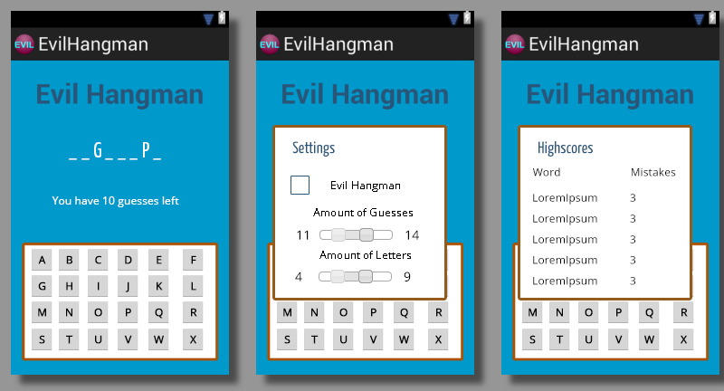

# Design Document

Interface
* Hangman

Classes
* EvilHangman
* NormalHangman
* Words

ClickHandlers
* ButtonClickHandler
* RestartGameClickHandler
* SettingsClickHandler
* SaveSettingsClickHandler

Activities and Views
* MainActivity
* LostActivity
* WinActivity
* HighscoreActivity
* PreferenceActivity

# Code Conventions

http://www.oracle.com/technetwork/java/codeconv-138413.html

# UI Sketch

